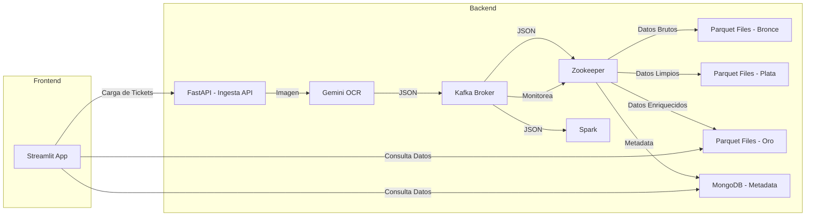

# 🛒 SmartCart: Tu Asistente Inteligente para Compras de Supermercado 🧠

[](https://img.shields.io/badge/Estado-En%20Desarrollo-yellow.svg)
[](https://opensource.org/licenses/MIT)

**SmartCart** es una solución innovadora que transforma la forma en que gestionas tus compras de supermercado.  Digitaliza tus tickets, analiza tus gastos, te ofrece recomendaciones personalizadas, y se integra con tus datos bancarios (opcional) para darte una visión completa de tus finanzas.

## 🌟 Sobre SmartCart

SmartCart aborda un problema común: la falta de control y optimización en los gastos de supermercado.  La mayoría de las personas no analizan sus tickets de compra, perdiendo oportunidades de ahorro, y las aplicaciones bancarias ofrecen una visión limitada de estos gastos.

**Nuestra solución:**

*   **Digitaliza** tus tickets de compra usando tecnología OCR (Reconocimiento Óptico de Caracteres).
*   **Organiza** tus gastos por categorías, productos y supermercados.
*   **Analiza** tus patrones de compra para identificar oportunidades de ahorro. (pendiente)
*   **Te ofrece** recomendaciones personalizadas (productos alternativos más baratos, ofertas, productos sostenibles).  (pendiente)
*   **Se integra** con tus datos bancarios para una visión financiera 360°. (pendiente)

## ✨ Características Principales

*   **Escaneo de tickets:**  Digitalización rápida y precisa de tickets de compra.
*   **Categorización automática:**  Clasificación de productos en categorías (alimentación, limpieza, etc.).
*   **Análisis de gastos:**  Visualización de tus gastos por categoría, producto, supermercado y a lo largo del tiempo.
*   **Recomendaciones personalizadas (pendiente):**  Sugerencias de productos más baratos, ofertas relevantes y opciones más sostenibles.
*   **Integración bancaria (pendiente):**  Conexión segura con tus cuentas bancarias para una visión completa de tus finanzas.
*   **Interfaz intuitiva:**  Aplicación web fácil de usar, construida con Streamlit.
*   **Arquitectura escalable:**  Diseñada para manejar grandes volúmenes de datos y usuarios.
*   **Seguridad:**  Protección de datos personales y financieros.

## 🛠️ Tecnologías Utilizadas

*   **Frontend:**  [Streamlit](https://streamlit.io/)
*   **Backend:**
    *   [FastAPI](https://fastapi.tiangolo.com/)
    *   [Apache Kafka](https://kafka.apache.org/)
    *   [Apache Spark](https://spark.apache.org/)
    *   [Gemini API](https://ai.google.dev/tutorials/python_quickstart) (para OCR)
    *   [MongoDB](https://www.mongodb.com/)
*   **Almacenamiento:** Formato Parquet
*   **Contenedores:**  [Docker](https://www.docker.com/) y [Docker Compose](https://docs.docker.com/compose/)

## 🏗️ Arquitectura



**Descripción de las capas:**

*   **Capa Bronce (Raw):**  Almacena los datos en bruto (imágenes de tickets y JSON del OCR).
*   **Capa Plata:**  Almacena los datos limpios y transformados (formato Parquet).
*   **Capa Oro:** Almacena los datos listos para análisis y visualización (formato Parquet).

**Contenedores Docker (Orquestados con Docker Compose):**

*   **`zookeeper`:**  Necesario para el funcionamiento de Kafka.
*   **`kafka`:**  Broker de mensajería para la ingesta de datos en tiempo real.
*   **`spark`:**  Motor de procesamiento distribuido para la transformación y análisis de datos.
*   **`ocr`:**  Contenedor Python que ejecuta el modelo Gemini para OCR y envía los resultados a Kafka.
*   **`mongodb`:**  Base de datos NoSQL para almacenar metadatos y, opcionalmente, copias de seguridad de las imágenes.
*   **`streamlit`:**  Aplicación web interactiva para la visualización de datos y la interacción del usuario.
*    **`fastapi`**:  Aplicación que sirve como API para la ingesta de tickets.

## ⚙️ Instalación y Configuración

**Requisitos previos:**

*   [Docker](https://docs.docker.com/get-docker/)
*   [Docker Compose](https://docs.docker.com/compose/install/)
*   [Python 3.8+](https://www.python.org/downloads/)
*   Una clave de API de Gemini (consulta la [documentación de Gemini](https://ai.google.dev/tutorials/python_quickstart)).
*   *Opcional:* Credenciales para una API bancaria (si quieres probar la integración).

**Pasos de instalación:**

1.  **Clona el repositorio:**

    ```bash
    git clone https://github.com/EOITFMDE25/TFM.git
    cd TFM
    ```

2.  **Configura las variables de entorno:**

    Crea un archivo `.env` en el directorio raíz del proyecto y añade las siguientes variables (reemplaza los valores por los tuyos):

    ```
    GEMINI_API_KEY=tu_clave_api_de_gemini
    KAFKA_BOOTSTRAP_SERVERS=localhost:9092
    ```

3.  **Construye y ejecuta los contenedores Docker:**

    ```bash
    docker-compose up --build
    ```

4.  **Accede a la aplicación:**

    Abre tu navegador y ve a `http://localhost:8501` (o el puerto que hayas configurado para Streamlit).

## 📝 Uso de la Aplicación

1.  **Carga de tickets:**
    *   En la página principal de la aplicación, haz clic en el botón "Cargar Ticket".
    *   Selecciona una imagen de un ticket de compra (formato JPG, PNG o PDF).
    *   Haz clic en "Procesar".

2.  **Visualización de datos:**
    *   Una vez procesado el ticket, la aplicación mostrará los datos extraídos (productos, precios, total).
    *   Explora los diferentes dashboards para ver tus gastos por categoría, supermercado, etc.

3.  **Recomendaciones (pendiente):**
    *   La aplicación te mostrará recomendaciones personalizadas (productos alternativos, ofertas, etc.).

4.  **Integración bancaria (pendiente):**
    *   Si has configurado la integración bancaria, podrás ver tus transacciones bancarias junto con tus datos de tickets.

## 🧪 Pruebas

El proyecto incluye pruebas unitarias y de integración.  Para ejecutarlas:

```bash
# Pruebas unitarias (ejemplo con pytest)
pytest tests/unit

# Pruebas de integración (ejemplo)
pytest tests/integration
```

*   **`tests/unit`:**  Contiene pruebas unitarias para componentes individuales (funciones, clases).
*   **`tests/integration`:**  Contiene pruebas de integración que verifican la interacción entre diferentes componentes.

## 📧 Contacto

Para preguntas, comentarios o sugerencias, por favor contacta con:

*   tfmde25@gmail.com

---

**Roadmap (Próximos Pasos):**

*   [ ] Integración con más APIs bancarias.
*   [ ] Desarrollo de un modelo de recomendaciones más avanzado (machine learning).
*   [ ] Implementación de alertas personalizadas (ofertas, productos próximos a caducar).
*   [ ] Creación de una versión móvil nativa (iOS/Android).
*   [ ] Exploración de alianzas estratégicas con supermercados y fintechs.

---
**Créditos:**
Agradecimientos al equipo y al centro de formación EOI.
